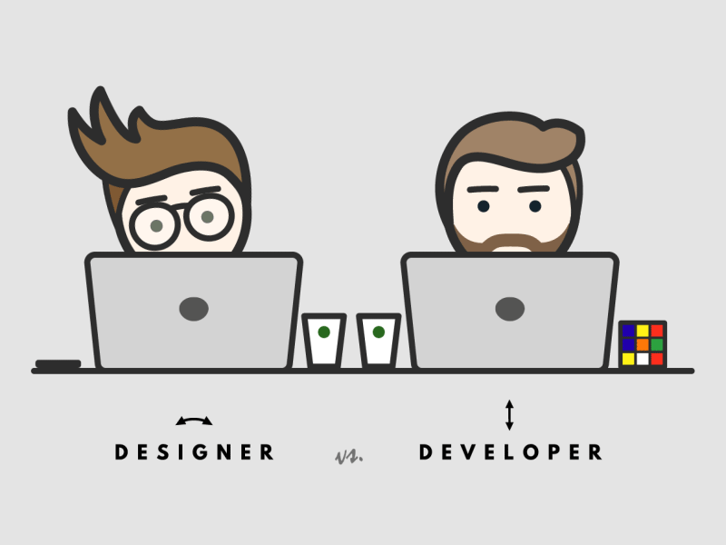

### About Me 

<!--
**nmbazima/nmbazima** is a ✨ _special_ ✨ repository because its `README.md` (this file) appears on your GitHub profile.

Here are some ideas to get you started:
-->

  

At my place of work i am a developer. 🔭 my current focus now is on **Report Development and Visualizations** with tools such as SSRS, Power BI, Tableau plus Alteryx and 🌱 currently learning **Data Engineering, Data Analytics & Computer Vision**, i am still looking to 👯 collaborate with others with similar interests also on **AI, DataOps** etc..., but still need help on 🤔 **AI**. AMA about 💬 **ArchLinux, PowerBI, SQL, Python, Microsoft Dynamics RMS & NAV, Azure - AI | Data | PowerApps | PowerAutomate, SAP BI, iSAMS School Management**. Thanks for viewing my profile you can reach me on 📫 **[Newton's Linkedin Profile](https://www.linkedin.com/in/nmbazima/)**

      

